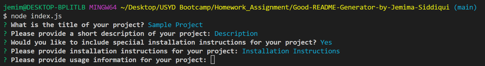
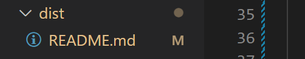

# Good README Generator - by Jemima Siddiqui 
## Description
This project will generate a high quality README file based on user inputs from the command line. 
## Table of Contents
* [Installation](#installation)
* [Usage](#usage)
* [License](#license)
* [Contributions](#contributions)
* [Testing](#testing)
* [Questions](#questions)

## Installation

### Downloading Visual Studio Code 

 Download the latest version of Visual Studio to your local machine (Mac, Linux or Windows). Please use the following link to download the latest version of VS Code [Download VS Code](https://code.visualstudio.com/download). 

### Pulling the repository from Git 

If you would like to acess the source code, please navigate to the following public Github repository [Github Repository](https://github.com/JemimaSiddiqui/Good-README-Generator-by-Jemima-Siddiqui.git). 

* Clone the repository to your local desktop using the following steps:

  * 🔑 Use the terminal command `cd` to navigate to the directory where we want the repository located. In this case, we will save it to the Desktop. 

  ```bash
  cd Desktop
  ```

  * 🔑 Use the git command `git clone` followed by the URL copied from Github to clone the repo to our local machine.

  ```bash
  git clone <url>
  ```

  * 🔑 Use the `git clone` command creates a new directory with the same name as the repository. We navigate into our new directory using `cd`.

  ```bash
  cd Good-README-Generator-by-Jemima-Siddiqui
  ```
* After the repository has been cloned to your local machine, open the files using Visual Studio application. 

## Usage
In order to see a demonstration of this application, navigate to the following link: https://drive.google.com/file/d/1zXtCDaraC7eEtO42zrnMM0QQwnM3euk2/view

* Step 1: Change into the directory of the application 
* Step 2: Run by using the following command in the command terminal in VS Code. 

  ```bash
  node index.js 
  ```
* Step 3: You will be presented with a series of questions as shown in the image below. Please answer these questions. 



* Step 4: Once you have answered all the questions, you will see a recently generated README file in the dist folder (please ensure that before answering all the questions and clicking enter, the dist folder is empty and does not contain a README file to start of with). 



## License
This application is covered under the MIT license.

    
## Questions
Author: [JemimaSiddiqui](https://github.com/JemimaSiddiqui)

If you have any further questions, please feel free to contact me at: [jemimasiddiqui12@gmail.com](mailto:jemimasiddiqui12@gmail.com)
